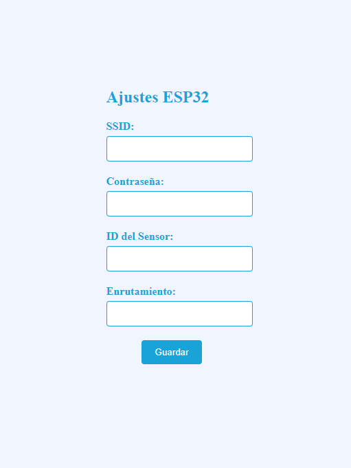

# Bascula-ESP32.
# Descripción.
Código para la creación de una báscula inteligente con conexión a internet, con sistema de configuración wifi. Dentro de este repositorio se encuentran los archivos necesarios para funcionar.

# Interfaz de configuración.

